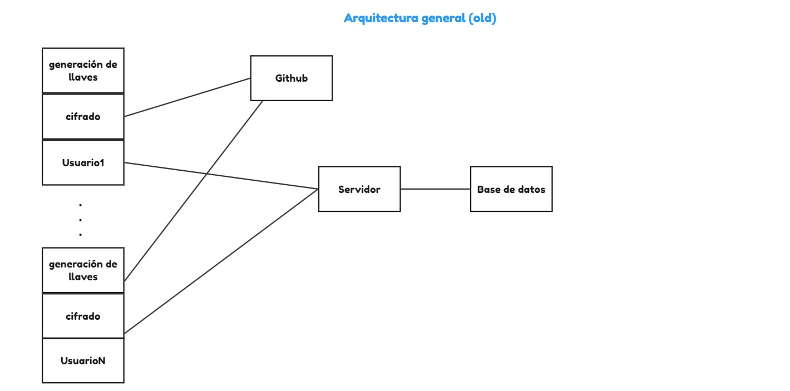
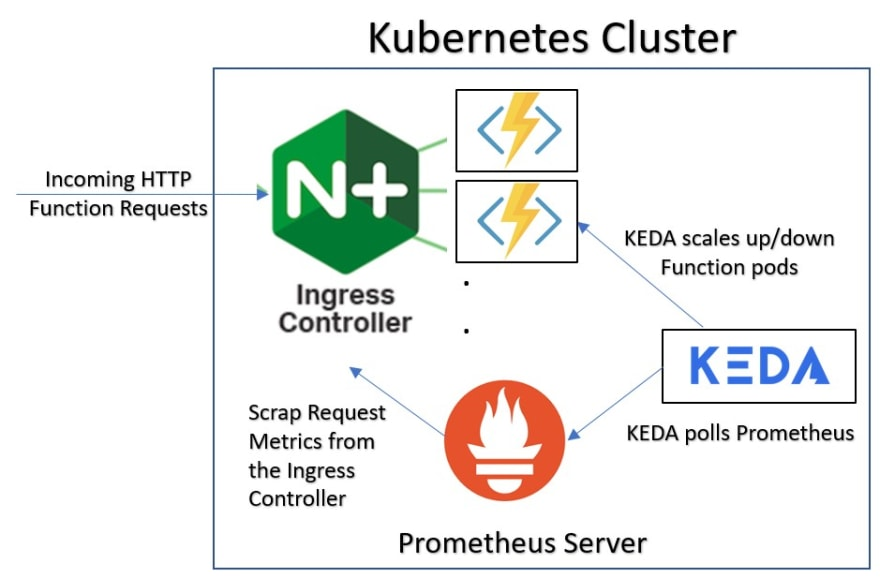
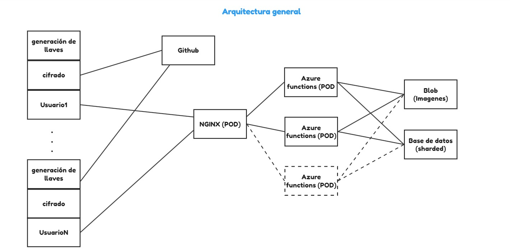

# Backend

El siguiente servicio de Backend utiliza Kubernetes para realizar escalamiento a medida que incrementa la tasa de solicitudes por unidad de tiempo. Utiliza las direcitvas de KEDA para realizar consultas al servidor de Prometheus alojado y obtener aquellos valores.

## Arquitectura


Arquitectura inicial:



Arquitectura nueva para la nube:




## Prerrequisitos

### Comandos

Es necesario tener instalado lo siguiente:
- Docker: https://docs.docker.com/engine/install/
- Helm: https://helm.sh/docs/helm/helm_install/
- Kubectl: https://kubernetes.io/docs/tasks/tools/
- Azure Functions Core Tools v.4.0.5611: https://github.com/Azure/azure-functions-core-tools/blob/v4.x/README.md#windows

### Servicios de Nube

Utilizando una nube o más nubes, crear los siguientes servicios similares:
- Base de datos Mongo: (Se utilizó CosmosDB)
- Bucket de archivos: (Se utilizó Azure Blob Storage)
- Kubernetes Cluster

### Variables

A lo largo de la documentación, se utilizan las siguientes variables dependiendo de cada implementación.

- ${DOCKER-REGISTRY}: Registro de docker donde se sube la imagen
- ${EXTERNAL-IP}: Dirección IP definida por el ingress controller 

## Definición de variables de entorno

Tomar el archivo `template.local.settings.json`, copiarlo en el archivo `local.settings.json` y completarlo con los valores que se indican.

- MONGO_USERNAME: Usuario de MongoDB
- MONGO_PASSWORD: Contraseña de MongoDB
- MONGO_URI: URI de conexión a la base de datos de mongo
- IMAGES_ENDPOINT: Endpoint al bucket de manera que los archivos puedan accederse de la siguiente manera `f'{IMAGES_ENDPOINT}/images/a.png'`
- AZURE_STORAGE_CONNECTION_STRING: Cadena de conexión al bucket de azure

## Configuracion del cluster

Instalar charts en el namespace **ingress-nginx** y habilitarlo para que trabaje con métricas de prometheus. Adicionalmente, crear el controlador de ingreso de nginx.
```sh
helm repo add ingress-nginx https://kubernetes.github.io/ingress-nginx
helm repo update

kubectl create namespace ingress-nginx

helm install ingress-nginx ingress-nginx/ingress-nginx \
--namespace ingress-nginx \
--set controller.metrics.enabled=true \
--set-string controller.podAnnotations."prometheus\.io/scrape"="true" \
--set-string controller.podAnnotations."prometheus\.io/port"="10254"
```

Utilizar este comando para crear un recurso Secrets con los valores del local.settings.json.

```
func kubernetes deploy --name anytwitter --namespace ingress-nginx --service-type ClusterIP --registry ${DOCKER-REGISTRY}
```

Correr este comando para obtener los servicios y conseguir la IP externa del servicio **ingress-nginx-controller**. Va por el nombre de EXTERNAL-IP.

```sh
kubectl get services -n ingress-nginx
```

Instalar el servidor de métricas de prometheus.

```sh
kubectl apply --kustomize github.com/kubernetes/ingress-nginx/deploy/prometheus/
```

Instalar los charts de keda para crear escalamiento en base a disparadores (triggers).

```sh
kubectl create namespace keda

helm repo add kedacore https://kedacore.github.io/charts
helm repo update

helm install keda kedacore/keda --namespace keda
```

Correr este archivo yaml para crear el deployment con la imagen en el registro. **Nota:** Es necesario cambiar la línea del archivo `kubernetes/deployment.yaml` con lo siguiente para especificar el registro:

```yaml
image: ${DOCKER-REGISTRY}/anytwitter:latest
```

```sh
kubectl apply -f kubernetes/deployment.yaml -n ingress-nginx
```

Crear un servicio ClusterIP en base al deployment creado previamente.

```sh
kubectl apply -f kubernetes/service.yaml -n ingress-nginx
```

Definir las reglas del ingress controller para que redireccione las solicitudes al servicio de ClusterIP. **Nota:** Es necesario cambiar la línea del archivo `kubernetes/ingress.yaml` con lo siguiente para que acceda a la dirección IP del ingress controller del cluster:

```yaml
  - host: "${EXTERNAL-IP}.nip.io"
```

```sh
kubectl apply -f kubernetes/ingress.yaml -n ingress-nginx
```

Crear un ScaledObject que se encargue del escalamiento en base a las métricas del servidor de Prometheus. Actualmente escala si existe una tasa de solicitudes mayor a 10 solicitudes cada 20 segundos.

```sh
kubectl apply -f kubernetes/scaled-object.yaml -n ingress-nginx
```

Se accede a las métricas de Prometheus mediante el siguiente comando
```sh
kubectl port-forward deployment/prometheus-server 9090:9090 -n ingress-nginx
```

## Caso en donde la imagen [prober76:anytwitter](https://hub.docker.com/r/prober76/anytwitter) no exista

Existe un `DockerFile` en el repositorio el cual se puede usar para subir otra imagen al docker registry. Después de ello se tiene que reemplazar el nombre de la imagen en `deployment.yaml`:

```
      - name: anytwitter
        image: {nuevo nombre}
        ports:
        - containerPort: 80
```

## Acceder al API

Las rutas de la api son las siguientes:

- GET /api/base
- GET /api/obtenerMensajes
- GET /api/obtenerTweets
- GET /api/getKeysList
- GET /api/getKeys/{handle}
- POST /api/login
- POST /api/crearUsuario
- POST /api/tweet
- POST /api/submitMessage

## Información sobre KEDA

```yaml
apiVersion: keda.sh/v1alpha1
kind: ScaledObject
metadata:
  name: prometheus-scaledobject
  namespace: ingress-nginx
  labels:
    deploymentName: anytwitter
spec:
  scaleTargetRef:
    kind: Deployment
    name: anytwitter 
  minReplicaCount: 1
  maxReplicaCount: 10
  pollingInterval: 15
  cooldownPeriod: 30
  triggers:
  - type: prometheus
    metadata:
      serverAddress: http://prometheus-server.ingress-nginx.svc.cluster.local:9090
      metricName: nginx_ingress_controller_requests
      threshold: '10'
      query: sum(rate(nginx_ingress_controller_requests[20s]))
```

Hablando de los diferentes elementos:
- **minReplicaCount**: Número mínimo de pods que se pueden tener en el deployment.
- **maxReplicaCount**: Número máximo de pods que se pueden tener en el deployment.
- **pollingInterval**: Intervalo de tiempo en segundos en el que se revisan las métricas.
- **cooldownPeriod**: Tiempo en segundos que se espera antes de volver a escalar.
- **triggers**: Lista de triggers que se pueden utilizar para escalar. En este caso, se utiliza el trigger de prometheus.
  - **type**: Tipo de trigger que se utiliza.
  - **metadata**: Metadatos del trigger.
    - **serverAddress**: Dirección del servidor de prometheus.
    - **metricName**: Nombre de la métrica que se utiliza.
    - **threshold**: Umbral que se utiliza para escalar.
    - **query**: Consulta que se realiza al servidor de prometheus.

Con respecto a la directiva **triggers**, se puede utilizar diferentes tipos de triggers. En este caso, se utiliza el trigger de prometheus. Entre los diferentes tipos (**type**) se encuentran:
- ActiveMQ
- ActiveMQ Artemis
- Apache Kafka
- Apache Kafka (Experimental)
- Apache Pulsar
- ArangoDB
- AWS CloudWatch
- AWS DynamoDB
- AWS DynamoDB Streams
- AWS Kinesis Stream
- AWS SQS Queue
- Azure Application Insights
- Azure Blob Storage
- Azure Data Explorer
- Azure Event Hubs
- Azure Log Analytics
- Azure Monitor
- Azure Pipelines
- Azure Service Bus
- Azure Storage Queue
- Cassandra
- CouchDB
- CPU
- Cron
- Datadog
- Elasticsearch
- Etcd
- External
- External Push
- Github Runner Scaler
- Google Cloud Platform Cloud Tasks
- Google Cloud Platform Pub/Sub
- Google Cloud Platform Stackdriver
- Google Cloud Platform Storage
- Graphite
- Huawei Cloudeye
- IBM MQ
- InfluxDB
- Kubernetes Workload
- Liiklus Topic
- Loki
- Memory
- Metrics API
- MongoDB
- MSSQL
- MySQL
- NATS JetStream
- NATS Streaming
- New Relic
- OpenStack Metric
- OpenStack Swift
- PostgreSQL
- Predictkube
- Prometheus
- RabbitMQ Queue
- Redis Lists
- Redis Lists (supports Redis Cluster)
- Redis Lists (supports Redis Sentinel)
- Redis Streams
- Redis Streams (supports Redis Cluster)
- Redis Streams (supports Redis Sentinel)
- Selenium Grid Scaler
- Solace PubSub+ Event Broker
- Solr
